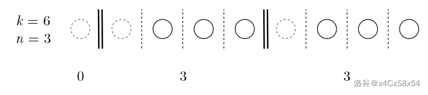

# counting states

-------

## Notations

for a states with degenerate quantum states, we label our basic quantities as:

- **Energy Levels:**  	$\varepsilon_1$     $\varepsilon_2$     $\varepsilon_3$     ...
- **Degeneracy:**          $\omega_1$     $\omega_2$    $\omega_3$     ...
- **Particle Number:**   $a_1$     $a_2$     $a_3$     ...
- **Total Particles:**      N
- **number of states**: $\Omega$

## Maxwell Boltzmann Distribution

Now we search for a simple situation, which have **distinguishable particles**.

For each energy level $\varepsilon_l$, we try to give the number of situations with **degeneracy** $\omega_l$ and **occupied particles** $a_l$, every particle have $\omega_l$ choices, thus gives
$$
\Omega(\varepsilon_l) = \omega_l^{a_l}
$$
Now we take all the levels into account, we should **multiple all the $\Omega(\varepsilon_l)$ in series**. Then we can firstly **divide every $\Omega(\varepsilon_l)$ by $a_l !$ and multiple a $N !$ factor**. This will gives particle distribution $a_1, a_2, a_3...$ occupying on energy levels $\varepsilon_1, \varepsilon_2, \varepsilon_3 ...$ state number:
$$
\Omega_{M,B} = \dfrac{N !}{\prod a_l !}\prod \omega_l^{a_l}
$$

## Bose Distribution

绷不住了, 快让我先用中文写了

现在讨论的是**每一个态**可以有**任意多粒子**的体系(区别于费米分布), 这样的话我们可以采取[*隔板法*](https://zhuanlan.zhihu.com/p/136062396)来讨论这个态个数

得到的结果应该是:
$$
\Omega_{B} = \prod \limits_{l} \dfrac{(\omega_l + a_l - 1)!}{a_l ! (w_l - 1)!}
$$

## Classical Approximation

如果满足**经典极限条件**为
$$
\dfrac{a_l}{\omega_l} \ll 1
$$
这样的话*玻色分布*和*麦克斯韦玻尔兹曼分布*的差别为:
$$
\begin{aligned}
\Omega_{B} &= \prod \limits_{l} \dfrac{(\omega_l + a_l - 1)!}{a_l ! (\omega_l - 1)!}\\
           &= \prod \limits_{l} \dfrac{(\omega_l + a_l - 1)(\omega_l + a_l - 2)...(\omega_l + 1)\omega_l}{a_l(a_l-1)...2\cdot 1}\\
           &\approx \prod \limits_{l} \dfrac{\omega_l !}{a_l !} = \dfrac{\Omega_{M,B}}{N !}
\end{aligned}
$$

## Question

但是我们回过头来看麦克斯韦玻尔兹曼分布的含义, 玻尔兹曼分布中我们也假设每一个量子态可以**任意的放置**粒子, 此时粒子都是可以分辨的, 然后如果我们把这个分布数目 $\Omega_{M, B}$ 除以 $N !$ ,哇塞这***似乎***就把**可辨**的粒子转变为了**不可辨**的粒子, 等等, 这和玻色分布有什么区别!

 

等等快了啊, 快了啊! 回头去看看这个**经典极限**取的过程. 经典极限中 $\dfrac{a_l}{\omega_l} \ll 1$, 说明的是每一个量子态粒子的占据数目会远少于1. 如果玻色分布是正确的, 那出问题的应该是我们对麦克斯伟玻尔兹曼分布加上$\frac{1}{N!}$ 的理解, 出错的地方就在于粒子**大量处于同一个量子态的情况**, 因为*经典极限*就是让这样的情况趋于不存在!

现在我们假设只有**一个量子态**, 有$a$个粒子放入这个量子态里面, 分别用两种统计方法来讨论, 首先看**玻色分布**, 因为我们只有一个隔间, 所以$\omega = 1$, 态个数为$\Omega_{B} = (\omega+a+1)!/a! = 1$, 这显然没问题, 因为我们只有一个格子, 所有粒子只能全部放进去, 这是唯一的系统的态.

然后看一看加上**全同性**条件后的**麦克斯韦玻尔兹曼分布**, $\Omega_{M, B}/N! = \frac{1^{a}}{a^!}$, 欸? 怎么成了**分数**?

哦! 问题在于即使在**粒子可辨**的情形下, 它们放在同一个态中的**态的数目**仍然是$1$, 而不是$N!$, 出的问题就在于*混淆*了**粒子全排列**和粒子**放入隔板**的情形.

现在我们有了结论了, 如果想问$\dfrac{\Omega_{M,B}}{N!}$究竟是个什么东西, 应该说什么都不是! $N!$ 除去的是**粒子的全排列**, 并*不是*在任何情况下都代表**取消粒子的可辨性**. 而在经典极限条件下, *不存在*多个粒子同时**放在一个量子态**的情况, 所以全排列恰好可以取消掉粒子的可辨性.

-----

